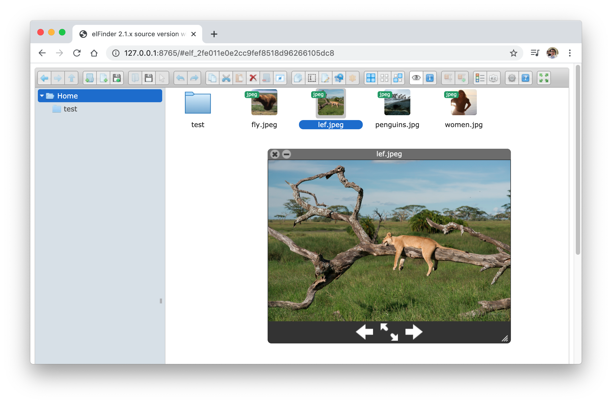

[](https://mybinder.org/v2/gh/oeway/pyramid_elfinder/master)

# Jupyter elFinder

A web file browser for managing data on remote jupyter servers, specifically built for the [ImJoy](https://imjoy.io) project, an open source platform for deploying computational tools to the end user.

The frontend is built with [elFinder](https://github.com/Studio-42/elfinder) and a Python backend server.

## What is elFinder?

elFinder is an open-source file manager for web, written in JavaScript using jQuery and jQuery UI, [the project](https://github.com/Studio-42/elfinder) is maintained by [Studio 42](https://github.com/Studio-42).

[Try their online demo here](https://studio-42.github.io/elFinder/).


## Installation

Python 3.5+ is required.

```sh
pip install -U jupyter-elfinder
```

## Basic Usage

In your terminal, run the following command:
```sh
jupyter-elfinder --thumbnail
```
(The thumbnail option enables thumbnail for images, it will create a folder named `.tmb` under your current folder, you can also disable that by remove the `--thumbnail` option.)


You will then see the following message:

```sh
==========Jupyter elFinder server is running=========
http://127.0.0.1:8765
```

Depending on where you started the command, the file browser will show your current folder as root directory or HOME. 

In order to browse your own directory, you can manually set the root directory by passing `--root-dir=/PATH/TO/MY/FOLDER`.




## Use it with remote Jupyter notebook server

If you don't have jupyter notebook, run:

```sh
pip install -U jupyter
```

Next, install Jupyter elFinder with jupyter server proxy extension:

```sh
pip install -U jupyter-elfinder[jupyter]
```

Now start Jupyter notebook as you would do normally, for example:

```sh
jupyter notebook --ip=0.0.0.0
```

You will get a web file browser at `http://YOUR_NOTEBOOK_URL/elfinder` (depending on what you get from your notebook, for example, the url can be `http://localhost:8000/elfinder`).

## Start a demo with MyBinder

1. Start an instance on MyBinder: https://mybinder.org/v2/gh/oeway/pyramid_elfinder/master

2. Get the generated Jupyter Notebook URL and add `/elfinder` after, make sure you have something like `https://hub.gke.mybinder.org/user/oeway-pyramid_elfinder-q2q1dhbn/elfinder`

3. You should be able to see a file browser.

## Security Considerations

Please be aware that there is potential risk to use Jupyter elFinder locally or remotely over the internet.

Here are some suggestions:
1. Try to set root-dir to a folder containing the files you actually need, as minimal as possible, avoid exposing the entire file system.

2. For remote servers, use it via the Jupyter proxy such that the access will be protected by jupyter token or password. also, do not turn off the authentication in Jupyter.

3. For running it locally, we use allow-origin header (CORS) to protect access from a random website, for that to work, please use a modern browser and keep it updated.

4. Update Jupyter elFinder regularly with 'pip install -U jupyter-elfinder', in case there is security updates.

## License

MIT
